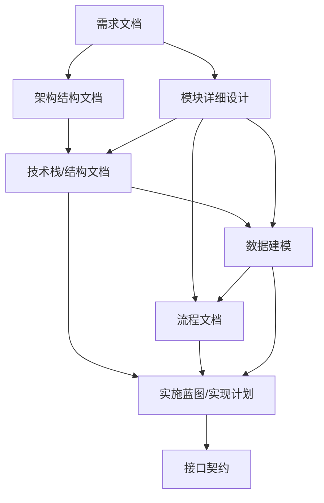

# Agent协同开发方法论：总监-执行者双层架构
## (The Director-Worker Agentic Development Methodology)

### 1. 核心理念 (Core Philosophy)
本方法论源于本次项目的成功实践，核心思想是将复杂的全栈开发任务拆解为**"总监-执行者" (Director-Worker)** 双层架构。通过在**设计阶段 (Design Phase)** 进行极高密度的信息压缩与结构化，将模糊的需求转化为精确的**实施蓝图 (Blueprints)**，从而在**执行阶段 (Execution Phase)** 实现多Agent并行、高效率、零歧义的代码生成。

---

### 2. 角色定义 (Roles)

#### 2.1 总监 Agent (The Director)
- **职责**: 负责全局架构、流程设计、数据定义、接口契约。
- **能力**: 高度的抽象思维、系统设计能力、逻辑自洽性检查。
- **产出**: 结构化的设计文档、流程图 (PlantUML)、数据库SQL、模块实现计划。
- **上下文**: 全局视野，了解所有模块的关联与依赖。

#### 2.2 执行者 Agent (The Workers)
- **职责**: 负责具体模块的代码实现与调试。
- **能力**: 强大的编码能力、框架熟练度、Bug排查能力。
- **输入**: 仅包含本模块相关的"上下文包" (实施蓝图)。
- **特点**: 并行工作，互不干扰，严格遵循蓝图，不质疑架构决策。

---

### 3. 实施流程详解 (The Process)

#### 第一阶段：设计与蓝图构建 (Phase 1: Design & Blueprinting)
**执行环境**: 单一 Conversation (总监模式)
**目标**: 将非结构化需求转化为结构化实施文档，完成"虚拟构建"。

**文档依赖关系图 (Document Dependency Graph)**:

1.  **需求结构化 (Requirement Serialization)**
    -   **依赖**: 原始用户输入。
    -   **动作**: 将非结构化信息转化为结构化的 Markdown 文档。
    -   **产出**: `需求规格说明书.md` / `项目综述.md`。

2.  **架构拆解 (Architecture Decomposition)**
    -   **依赖**: `需求规格说明书.md` (明确功能边界)。
    -   **动作**: 确立系统边界，划分顶级模块 (如 Frontend, Backend, AI Service)。
    -   **产出**: `设计阶段/project_structure.md` (初步目录结构)。

3.  **模块深化 (Module Detailing)**
    -   **依赖**: `设计阶段/project_structure.md` (明确模块划分)。
    -   **动作**: 对每个子模块进行详细功能描述，确定职责边界。
    -   **产出**: `设计阶段/module_docs/`。

4.  **技术栈与结构统一 (Project Structure & Tech Stack Standardization) —— ⭐关键步骤**
    -   **依赖**: `设计阶段/module_docs/` (根据功能需求选型)。
    -   **动作**: 统一项目目录结构、技术栈选型（Language/Framework/DB）、命名规范。
    -   **产出**: `设计阶段/project_structure.md` (最终版)。
    -   **意义**: 确保后续所有代码生成基于统一的物理骨架。

5.  **数据建模 (Data Modeling)**
    -   **依赖**: 
        -   `设计阶段/module_docs/` (业务实体定义)
        -   `设计阶段/project_structure.md` (数据库选型)
    -   **动作**: 设计 E-R 图，确定表结构及其关系。
    -   **产出**: `设计阶段/数据库设计/database_design.md` + `init_schema.sql`。

6.  **流程编排 (Process Orchestration)**
    -   **依赖**:
        -   `设计阶段/module_docs/` (业务逻辑)
        -   `设计阶段/数据库设计/database_design.md` (数据流转基础)
    -   **动作**:
        1. 生成 **总流程文档** (Global Flow)。
        2. 拆解 **子模块流程** (Sub-flows)，每个模块建立独立文件夹。
        3. 绘制 **PUML 流程图** (可视化逻辑)，明确数据流向和时序。
    -   **产出**: `设计阶段/流程文档/` (含总览及各子模块文件夹)。

7.  **实施蓝图 (Implementation Planning) —— ⭐关键步骤**
    -   **依赖**:
        -   `设计阶段/流程文档/` (业务逻辑链路)
        -   `设计阶段/数据库设计/database_design.md` (数据存取结构)
        -   `设计阶段/project_structure.md` (代码文件位置)
    -   **定义**: 这是连接设计与开发的桥梁，将"做什么"转化为"怎么做"。
    -   **动作**: 结合流程图和模块设计，编写具体的代码级计划。
    -   **内容**: 包含核心类设计、伪代码、关键算法、依赖库、目录结构。
    -   **产出**: `设计阶段/模块实现计划文档/` (如 `前端计划.md`, `后端计划.md`, `AI服务计划.md`)。

8.  **接口契约 (Interface Definition)**
    -   **依赖**: `设计阶段/模块实现计划文档/` (各模块已确定的公共方法)。
    -   **动作**: 定义模块间通讯标准，确保并行开发时对接无误。
    -   **产出**: `设计阶段/接口文档/API接口文档.md`。

9.  **闭环审查 (Design Review)**
    -   **依赖**: 所有上述生成的文档。
    -   **动作**: 总监 Agent 对所有生成文档进行逻辑自洽性检查，确认无遗漏。
    -   **里程碑**: 确认"Design Phase" 闭环。

---

#### 第二阶段：并行执行与编码 (Phase 2: Parallel Execution)
**执行环境**: 多个独立的 Conversation (执行者模式)
**特点**: 上下文隔离，专注高效。

1.  **环境隔离 (Environment Setup)**
    -   开启 3 个独立的 Conversation (Frontend, Backend, AI)。

2.  **上下文注入 (Context Injection)**
    -   **动作**: 向每个执行者 Agent 发送特定的"上下文包"，而非全部文档。
    -   **前端 Agent 上下文**:
        -   `前端模块实现计划.md`
        -   `API接口文档.md`
        -   `流程文档/前端流程图.puml`
    -   **后端 Agent 上下文**:
        -   `后端模块实现计划.md`
        -   `database_design.md` + `sql`
        -   `API接口文档.md`
        -   `流程文档/后端流程图.puml`
    -   **AI Agent 上下文**:
        -   `AI服务模块实现计划.md`
        -   `数据格式定义`

3.  **自动化编码 (Autonomous Coding)**
    -   **动作**: Agent 根据蓝图直接生成代码，无需询问架构问题。
    -   **产出**: 具体的代码文件、单元测试。

---

### 4. 优势分析 (Key Benefits)

| 维度 | 传统模式 | Agent 总监-执行者模式 |
| :--- | :--- | :--- |
| **上下文管理** | 容易过载，Agent 记不住细节 | **按需注入**，每个 Worker 只关注自己的任务 |
| **开发效率** | 串行阻塞 | **并行加速**，多线程开发 |
| **代码质量** | 容易跑偏，依赖 Agent 临场发挥 | **蓝图驱动**，严格遵循设计规约 |
| **可维护性** | 文档缺失或滞后 | **文档即代码**，先有文档后有代码 |
| **纠错成本** | 代码写完才发现逻辑错误 | **设计阶段纠错**，修改文档比修改代码成本低得多 |

### 5. 总结 (Conclusion)

这种开发思路本质上是**"以文档为中心的软件工程 (Document-Centric Software Engineering)"** 在 AI 时代的进化。它不仅适用于本次毕设项目，也适用于任何复杂系统的 AI 辅助开发。通过严格的阶段划分和角色扮演，最大限度地发挥了 LLM 在宏观规划和微观实现上的不同优势。
